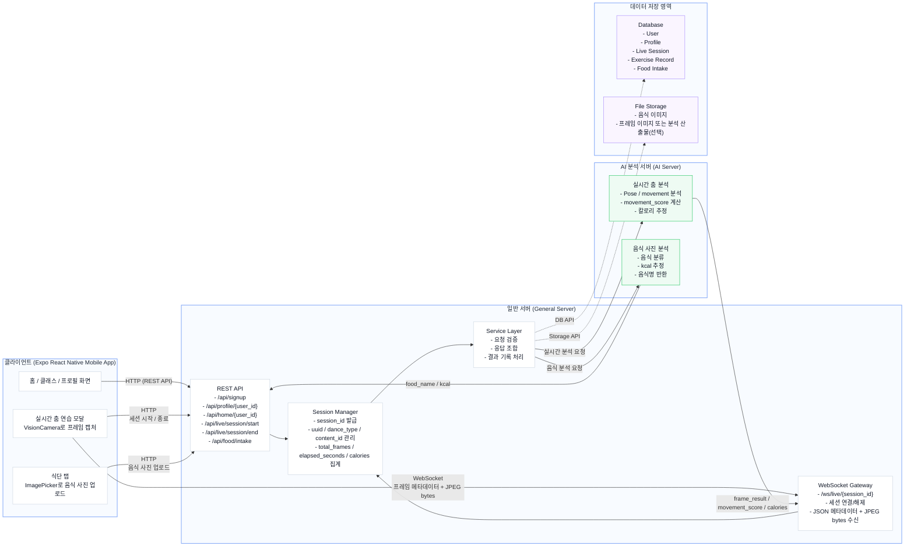

# 시스템 아키텍처

이 문서는 현재 모바일 앱 코드에서 확인된 통신 구조를 기준으로, 서비스의 핵심 기능 2가지를 한 장으로 정리한 아키텍처 문서입니다.

- 실시간 춤 분석: 현재 앱 코드에서 `HTTP + WebSocket` 흐름이 확인됨
- 음식 사진 분석: 현재 앱 UI와 서버 엔드포인트 설정은 확인되며, AI 분석 서버 연동은 목표 구조 기준으로 정리함

## 다이어그램

## 핵심 흐름

### 1. 실시간 춤 분석

1. 모바일 앱이 `POST /api/live/session/start`로 세션을 생성합니다.
2. 일반 서버가 `session_id`와 `ws_url`을 내려줍니다.
3. 앱이 `/ws/live/{session_id}` WebSocket에 연결합니다.
4. 앱은 VisionCamera로 캡처한 JPEG 프레임을 `JSON 메타데이터 + 바이너리 이미지` 형태로 전송합니다.
5. 일반 서버는 세션 상태를 관리하고 AI 분석 서버에 춤 분석을 요청합니다.
6. AI 분석 결과가 `movement_score`, `elapsed_seconds`, `calories`, `frame_result` 형태로 다시 전달됩니다.
7. 일반 서버가 결과를 앱으로 다시 보내고, 필요 시 세션 기록을 DB에 저장합니다.

### 2. 음식 사진 분석

1. 사용자가 식단 탭에서 사진을 촬영하거나 갤러리에서 선택합니다.
2. 앱이 일반 서버의 음식 관련 API로 이미지를 업로드합니다.
3. 일반 서버가 AI 음식 분석 서버에 이미지 분석을 요청합니다.
4. AI 서버가 음식 이름과 kcal 추정값을 반환합니다.
5. 일반 서버가 결과를 앱에 전달하고, 필요 시 음식 기록과 이미지를 저장합니다.

## 현재 코드 기준으로 확인된 구성

### 모바일 앱

- 실시간 춤 촬영/전송 로직: [`hooks/use-dance-vision-practice-modal-controller.ts`](/c:/Users/USER-PC/Desktop/dance-diet-client-mobileV4-vision-stream/hooks/use-dance-vision-practice-modal-controller.ts)
- 식단 사진 업로드 UI: [`app/(tabs)/food.tsx`](/c:/Users/USER-PC/Desktop/dance-diet-client-mobileV4-vision-stream/app/(tabs)/food.tsx)
- 서버 주소 및 WebSocket 주소 구성: [`services/server-config/base.ts`](/c:/Users/USER-PC/Desktop/dance-diet-client-mobileV4-vision-stream/services/server-config/base.ts)
- 일반 서버 API 엔드포인트 정의: [`services/server-config/general-server.ts`](/c:/Users/USER-PC/Desktop/dance-diet-client-mobileV4-vision-stream/services/server-config/general-server.ts)

### 일반 서버 쪽 연결 흔적

- 라이브 세션 WebSocket 경로 예시: `/ws/live/{session_id}`
- 라이브 세션 시작/종료 API: `/api/live/session/start`, `/api/live/session/end`
- 음식 관련 API 설정: `/api/food/intake`
- 서버 반영용 임시 패치 파일: [`tmp/server_transport_updates/socket_routes.py`](/c:/Users/USER-PC/Desktop/dance-diet-client-mobileV4-vision-stream/tmp/server_transport_updates/socket_routes.py), [`tmp/server_transport_updates/session_manager.py`](/c:/Users/USER-PC/Desktop/dance-diet-client-mobileV4-vision-stream/tmp/server_transport_updates/session_manager.py)

## 해석 메모

- 현재 앱 코드는 `모바일 앱 -> 일반 서버` 연결이 명확하게 구현되어 있습니다.
- 춤 분석은 실제로 `HTTP + WebSocket` 조합이 코드에 반영되어 있습니다.
- 음식 분석은 현재 앱 화면은 준비되어 있지만, 이 저장소 안에서는 아직 실제 분석 요청 코드가 붙어 있지 않습니다.
- 그래서 위 다이어그램의 음식 AI 분석 파트는 "현재 구조 + 목표 구조"를 함께 반영한 설계 문서로 보면 됩니다.

